## Entity-Relationship Model

* A key or candidate key is a minimal set of attributes to uniquely identify an entity

#### Key Constraints

##### One-to-many

* One-to-many constraint from A to B
* An entity in B can be associated with at most one entity in A

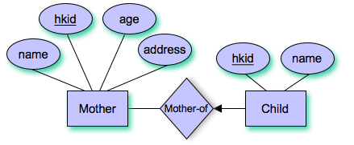

##### Many-to-one

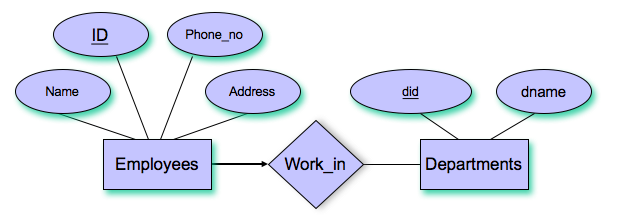

##### One-to-one

* An entity in A/B is related to at most one entity in B/A

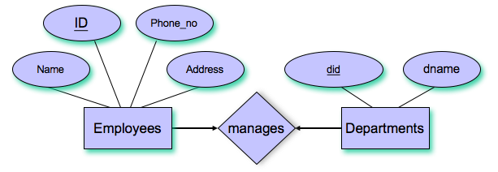

#### Participation Constraints

* Total: each entity in entity set must participate in **at least one** realtionship
* Partial: an entity in entity set may not participate in a relationship

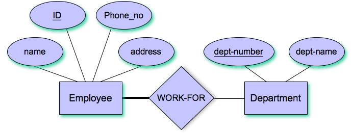

 * Example of total participation

#### Weak Entities

* Without super key
* It may not be distingusihable from others **without associations** with entites in other entity sets

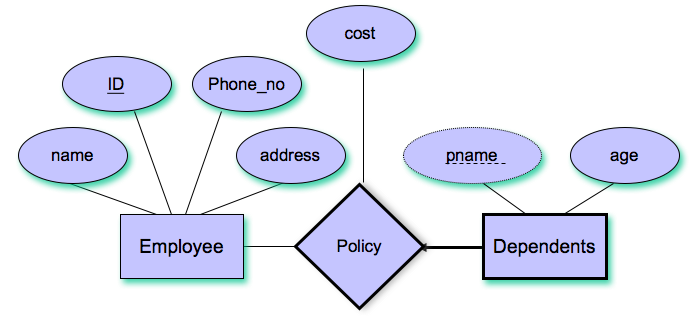

#### Class Hierarchies

* Classify entities in an entity set into sub-classes

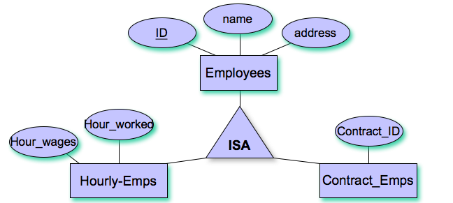


## Relational Algebra

### Basic Operation

Select		$\sigma$

Project		$\Pi$

Union		$\bigcup$

Set different	$-$

Product		$\times$

Rename		$\rho$

Division		$/$

#### Example

* $Select\ Relation\ a=b\ and\ d>5=\sigma_{a=b\bigwedge d>5} (R)$
* $\Pi_{f\_name,\ l\_name}(\sigma_{dno=4\bigwedge salary>25000}(Employee))$
* $Rename\ E.sid\ to\ C = \rho(C(sid\to identity),\ E)$
* $Condition\ Join = R\bowtie_cS = \sigma_c(R\times S)$

## SQL

### Basic SQL Query

```sql
SELECT [DISTINCT] target-list
FROM relation-list
WHERE qualification
```

* Equal Join with tables

```sql
SELECT S.sname
FROM Sailors S, Reserves R, Boat B 
WHERE S.sid = R.sid AND R.bid = B.bid 
```

* Regex in SQL

```sql
SELECT  S.age, age1=S.age-5, 2*S.age AS age2
FROM  Sailors S
WHERE  S.sname LIKE ‘B_%B’
```

`LIKE` $for\ string\ matching$, $"\_" means\ any\ characters$, $"\%" means\ arbitary$

* **Set**-manipulation construction

  * `UNION`			$\bigcup$

    `INTERSECTION`	$\bigcap$

    `EXCEPT`			$-$

```sql
SELECT S.sid
FROM Sailors S, Boats B, Reserves R
WHERE S.sid=R.sid AND R.bid=B.bid AND B.color=‘red’
INTERSECT
SELECT S.sid
FROM Sailors S, Boats B, Reserves R
WHERE S.sid=R.sid AND R.bid=B.bid AND B.color=‘green’
```

```sql
SELECT R.sid
FROM Boats B, Reserves R
WHERE R.bid=B.bid AND B.color=‘red’
EXCEPT
SELECT R.sid
FROM Boats B, Reserves R
WHERE R.bid=B.bid AND B.color=‘green’
```

* Correlated Nested Query

```sql
SELECT S.sname
FROM Sailors S
WHERE EXISTS(SELECT * FROM Reserves R WHERE R.bid=103 AND S.sid=R.sid)
```

* `EXISTS` to test for nonempty


* `IN` operator specified **multiple values** in `WHERE` clause

```sql
SELECT B.bname
FROM Boats B
WHERE B.color IN (‘red’, ‘blue’, ’green’)
```

* **Set-comparison** operators
* `ops ANY` or `ops ALL`

```sql
SELECT *
FROM Sailors S
WHERE S.rating > ANY (SELECT  S2.rating FROM  Sailors S2 WHERE 						  S2.sname=‘Horatio’)
```

* Division in SQL

```sql
SELECT S.sname
FROM Sailors S
WHERE NOT EXISTS 
      ((SELECT B.bid
        FROM Boats B)
        EXCEPT
       (SELECT R.bid
        FROM Reserves R
        WHERE R.sid=S.sid))
```

| SQL Aggregate Operators | Description                       |
| ----------------------- | --------------------------------- |
| **`COUNT(A)`**          | Number of values in A column      |
| **`SUM(A)`**            | Sum of all values in A column     |
| **`AVG(A)`**            | Average of all values on A column |
| **`MAX(A)`**            | Maximum value in the A column     |
| **`MIN(A)`**            | Minimum value in the A column     |

* Correct way to use the above operators

```sql
SELECT S.name
FROM Sailors S
WHERE S.age > (SELECT MAX (S2.age)
               FROM Sailors S2
               WHERE S2.rating = 10)
```

* `GROUP BY` similar as for-loop

```sql
SELECT S.rating, MIN(S.age)
FROM Sailors S
GROUP BY S.rating

For i = 1, 2, ..., 10:
    SELECT MIN(S.age)
    FROM Sailors S
    WHERE S.rating = i
```

* Columns appeared in `GROUP BY` should use `HAVING`
* `CREATE VIEW` for creating virtula table based on result SQL statement

```mysql
CREATE VIEW Temp AS
  SELECT S.rating, AVG (S.age) AS avgage
  FROM Sailors S
  GROUP BY S.rating

DROP VIEW temp
```

## Schema Refinement

#### Functional Dependencies

```
Let X and Y be nonempty sets of attributes in R
An instance r of R satisfies the FD X->Y if
If t1.X = t2.X, then t1.Y = t2.Y
```

#### Trivially Preserved

```
If any two row never have the same value for a in a->b
Then a->b is trivially preserved
```

#### Trivially Dependency

```
If right hand side of arrow is subset of that on left hand side a->b
Then a->b is a trivial dependency
```

#### Closure of set

* Given a set F, the set of all FDs implied is called the closure of F, denoted as $F^+$

#### Armstrong's Axioms and additional rules

* **Reflexivity**:		$if\ Y\subseteq X,\ then\ X \to Y$

  **Augmentation**:	$if\ X\to Y,\ then\ XZ\to YZ$

  **Trasitivity**:		$if\ X\to Y\ and\ Y\to Z,\ then\ X\to Z$

  **Union**:			$if\ X\to Y\ and\ X\to Z,\ then\ X\to YZ$

  **Decomposition**:	$if\ X\to YZ,\ then\ X\to Y\ and\ X\to Z$

#### Boyce-Codd Normal Form (BCNF)

$R\ -\ a\ relation\ schema$

$F\ -\ set\ of\ functional\ dependencies\ on\ R$

$\color{red}{R\ is\ in\ BCNF}\ if\ for\ any\ X\to A\ in\ F,$

* $X\to A\ is\ a\ trivial\ functional\ dependency,\ i.e.\ A\subseteq X$

  $\color{red}{OR}$

* $X\ is\ a\ superkey\ for\ R$

#### Third Normal Form

* If R is in BCNF, then it is also in 3NF since $3NF\subset BCNF$

$R\ -\ a\ relation\ schema$

$F\ -\ set\ of\ functional\ dependencies\ on\ R$

$\color{red}{R\ is\ in\ 3NF}\ if\ for\ any\ X\to A\ in\ F,$

- $X\to A\ is\ a\ trivial\ functional\ dependency,\ i.e.\ A\subseteq X$

  $\color{red}{OR}$

- $X\ is\ a\ superkey\ for\ R$

  $\color{red}{OR}$

- $A\ is\ part\ of\ some\ key\ for\ R$

#### Decomposition

1. Remove the rule X &rarr; A that violates the condition from relation schema R
2. Create a new realtional schema XA

#### Lossless Join Decomposition

$R\ -\ a\ relation\ schema$

$F\ -\ set\ of\ functional\ dependencies\ on\ R$

$The\ decomposition\ of\ R\ into\ relations\ with\ attribute\ sets\ R_1,\ R_2\ is\ lossless-join\ iff$

​	$(R_1\bigcap R_2)\to R_1 \in F^+$

​			$\color{red}{OR}$

​	$(R_1\bigcap R_2)\to R_2 \in F^+$

$R_1\bigcap R_2\ is\ a\ superkey\ for\ R_1\ or\ R_2$

#### Dependency preserved

$(F_1\bigcup F_2)^+ = F^+$

* Possible to obtain lossless-join decomposition into collection of BCNF relation schemas

  $non-BCNF\to BCNF$ but **NOT** guaranteed dependency-preserving

* Always exists a dependency-preserving, lossless-join decomposition into collection of 3NF relation schemas

  $non-3NF\to 3NF$

#### BCNF Decomposition

$Suppose\ X\to A\ is\ a\ FD\ that\ violates\ the\ BCNF\ condition$

1. Decompose $R$ into $XA$ and $R-A$
2. Repeat until all relations become BCNF

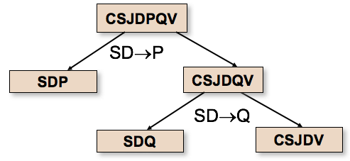

#### Canonical Cover

* A **minimal and equivalent** set of functional dependency

## Storage and Index

* Index on file speeds up selections on **search key fields**
* Search key can be any subset of fields of relation

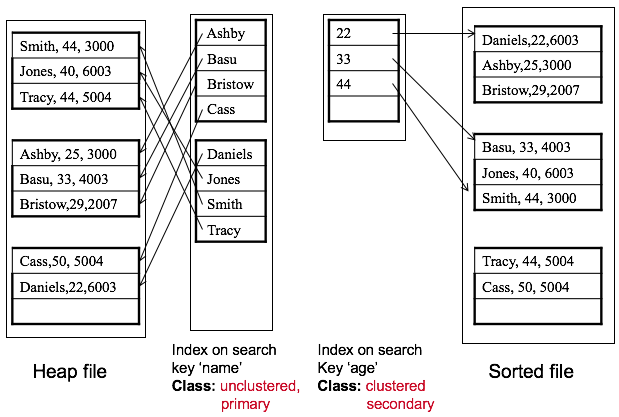

| Primary index         | Contains primary key in search key       |
| --------------------- | ---------------------------------------- |
| **Secondary index**   | **Does not contain primary key in search key** |
| **Clustered index**   | **Order of data records close to order of data entries** |
| **Unclustered index** |                                          |
| **Dense index**       | **At least one data entry per search key value** |
| **Sparse index**      | **Every sparse index is clustered**      |

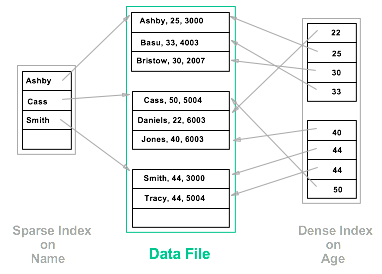

* **Unclustered** must be also in **dense**
  * Primary: each data entry $k^*$ points to **single record** that contains $k$
  * Secondary: each data entry $k^*$ points to **all records** that contains $k$
* **Clustered** must be also in **sparse**
  * Sort both data file and index file on search key
  * Each data entry $k^*$ points to the **first record** that contains $k$
  * Overflow pages may be needed for inserting, so the order is **closed to** sorted

#### Composite Search Keys

| Equality query  | Every field value is equal to a constant value |
| --------------- | ---------------------------------------- |
| **Range query** | **Some field value is not a constant**   |

## Tree-Structured Indexing

* Example of B+ tree with **order 1**

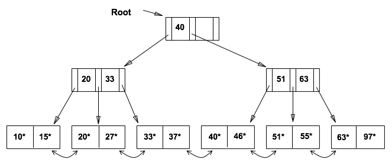

$For\ root\ node,\ we\ require\ 1\le n\le 2d,\ where\ d\ is\ the\ order$

$For\ non-root\ node,\ we\ require\ d\le n\le 2d,\ where\ d\ is\ the\ order$

#### Cost for searching in B+ tree

* Let $h$ be the height of B+ tree, then we have to access $h+1$ pages to reach leaf node
* Let $f$ be the average number of pointers in node ( *fanout* for internal node )
  * Level 1 with height 0 = $1$ page = $f^0$ page
  * Level 3 with height 2 = $f\times f$ page = $f^2$ page
* Suppose there are $d$ data entries, so there are $d\over{(f-1)}$ leaf nodes and $h = log_f({d\over f-1})$
* Example for calculation
  * Typical order = 100, Typical fill-factor = 67%
  * Average fanout $f$ = ${100\over67\%} = 133$
  * Given there are 10000000 data entries, $h = log_{133}({10000000\over133 - 1}) < 4$
  * Therefore, the cost is 5 pages read

## Extensible Hashing

* Given a search key value $k$, we can find the bucket where data entry $k^*$ is stored
* The value of has function $h(k)$ is address of desired bucket

*Hash-based indexes* are the best for **equality selections** and they do **NOT** support range searches

#### Static Hashing

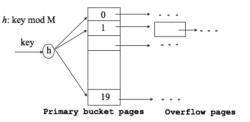

* **Long overflow chains** can be developed and degraded performance

#### Extendsible Hashing

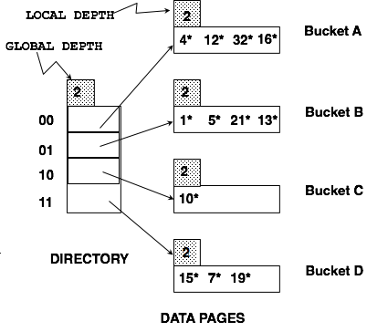

* To avoid re-hashing to re-organize file by doubling numbers of buckets, use directory of points to buckets
* Doubling here means increasing size of directories

$Suppose\ we\ have\ a\ hash\ function\ h(r)\ and\ directory\ is\ array\ of\ size\ 4$

$To\ find\ the\ bucket\ for\ r,\ take\ last\ x\ bits\ of\ h(r)\ where\ x\ is\ number\ of\ global\ depth$

* For inserting 20 in the above example, it will cause overflow and directory doubling is required

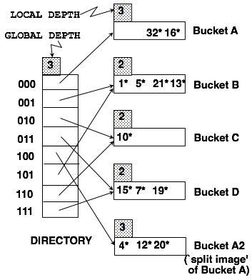

* Split Bucket A into 2 buckets and we compare 3rd bit from right in $h(r)$ to decide $A$ or $A_2$
* Other buckets will remain unchange and 2 directories are pointed to bucket for $Global\ Depth > Local\ Depth$
* **Least siginificant bits** are used in directory to allow for doubling via copying

## Query Evaluation

* **Buffer page** is in memory area and stored data page for processing
* Data file often needed to be **sorted** based on search key to speed up query evaluation

$Suppose\ a\ file\ contains\ M\ pages\ and\ B\ buffers\ are\ available\ in\ memory$

$File\ Sorting = 2\times M\times(\lceil log_{B-1}{M\over B}\rceil + 1)\ page\ accesses$

* **Access Path** is method of retrieving tuples
* **Selectivity** of an access = number of pages retrieved ( index pages + data pages )
* Consider only I/O cost = **number of pages** that are read/written

#### Example on selection

$Given\ the\ following\ schema:$

​	$Sailors(\underline{sid:\ integer},\ sname:\ string,\ rating:\ integer,\ age:\ real)$

​	$Reserves(\underline{sid:\ integer,\ bid:\ integer,\ day:\ dates},\ rname:\ string)$

​	$rname\ and\ sid\ may\ refer\ to\ different\ persons$

$Assuming\ the\ following\ sizes$

​	$Sailors:\ 500\ pages,\ 80\ tuples/page,\ 50\ bytes/tuple$

​	$Reserves:\ 1000\ pages,\ 100\ tupes/page,\ 40\ bytes/tuple$

$Consider\ selection:\ \sigma_{R.attribute = value} (R)\ and\ M\ denotes\ as\ Reserves\ pages$

$No\ index\ and\ unsorted\ =\ M\ pages\ I/Os\ for\ sequential\ scanning$

$No\ index\ but\ sorted = log_2M + M\times 10\%\ pages\ I/Os\ for\ binary\ searching + scanning$

​	$Above\ assumpion = 10\%\ tuples\ satisfy\ the\ condition$

$B+\ Tree\ index\ on\ R.attribute$

​	$1.\ Search\ tree\ to\ find\ first\ data\ entry\ that\ points\ to\ qualifying\ tuple\ of\ R$

​	$2.\ Scan\ leaf\ page\ to\ retrieve\ all\ data\ entries\ \color{red}{(not\ needed\ for\ clustered\ index)}$

​	$3.\ Follow\ the\ pointers\ to\ corresponding\ tuple\ of\ R\ for\ each\ data\ entry$

$Cost\ for\ B+\ tree\ index$

| Clustered index                          | Unclustered index                        |
| :--------------------------------------- | ---------------------------------------- |
| 1. Height of B+ tree, example: 3         | 1. Height of B+ tree, example: 3         |
| 2. Scan for numbers of leaf nodes        | 2. Scan data file: $1000\ pages\times 10\% = 100$ |
| 3. Costs: 10000 I/Os in worst case, each tuple in a page |                                          |

$Hash\ index\ on\ R.attribute$

​	$1.\ 0\ I/O\ for\ calculating\ hash\ value$

​	$2.\ 1\ I/O\ if\ directory\ does\ not\ fit\ in\ memory,\ else\ 0\ I/O$

​	$3.\ Retrieve\ bucket\ page\ pointed\ by\ directory\ entry,\ 1.2\ I/Os\ for\ overflow\ pages$

​	$4.\ Depend\ on\ how\ many\ pages\ pointed\ and\ qualifying\ tuples$

#### Example on projection

$Assuming\ the\ following\ sizes$

​	$Sailors:\ 500\ pages,\ 80\ tuples/page,\ 50\ bytes/tuple$

​	$Reserves:\ 1000\ pages,\ 100\ tupes/page,\ 40\ bytes/tuple$

```sql
SELECT DISTINCT R.sid, R.bid
FROM Reserves R
```

* General moethod

  * Scan relation $R$ and discard unwanted attributes
  * Eliminate duplicates &larr; Expensive operation

* Projection based on sorting

  1. Scan $R$ and write $sid$ and $bid$ of each tuple to temporary file $T$
  2. Sort $T$ based on attributes
  3. Scan sorted file and compare the adjacent tuples and discard duplicates

* Assume $T$ has 250 pages and 20 buffers available

  1. 1000 + 250 = 1250 I/Os

  2. $2\times 250\times (\lceil log_{20-1}{250\over 20}\rceil + 1)$

     $File\ Sorting = 2\times M\times(\lceil log_{B-1}{M\over B}\rceil + 1)\ page\ accesses$

  3. 250 I/Os

#### Example on join operation

$Assuming\ the\ following\ sizes$

​	$Sailors:\ 500\ pages,\ 80\ tuples/page,\ 50\ bytes/tuple$

​	$Reserves:\ 1000\ pages,\ 100\ tupes/page,\ 40\ bytes/tuple$

```sql
SELECT *
FROM Reserves R, Sailors S
WHERE R.sid=S.sid
```

##### Block Nested Loop Join

* Assume there are enough buffers to hold $B+2$ pages

  1 page is reserved to read Sailors and 1 page is reserved for output

  $for\ each\ block\ P\ of\ Reserves$

  ​	$for\ each\ page\ q\ of\ Sailors$

  ​		$for\ each\ r\in P\ and\ s\in q\ such\ that\ r.sid=s.sid$

  ​			$add<r,s>to\ the\ result$

* Assume B = 100, then Reserves R contains 10 blocks

  1. Scan Reserves R = 1000 I/Os

  2. Scan Sailors for each block = 500 I/Os

  3. Total number of I/Os = 1000 + 10x500 = 6000 I/Os

     Possible to sway Reserves and Sailors relations for smaller cost

* If buffer size is large enough to store smaller relation + 2 pages, the cost will be R + S = 1500 I/Os

##### Index Nested Loop Join

* Assume an index on sid of Sailors relation

  $for\ each\ r\in Reserves\ do$

  ​	$for\ each\ s\in Sailors\ where\ r.sid = s.sid$

  ​		$add <r,s> to\ the\ result$

* Cost for hash index

  1. Scan Reserve: 1000 I/Os
  2. For each tuple in Reserves, overflow 1.2 I/Os to get the matching bucket page
  3. For each matching Sailors data entry, retrieve Sailors tuple for 1 I/O since sid is primary key
  4. Each block of Reserves contains 100 tuples

* Total cost = 1000 + 100 x 1000 x ( 1 + 1.2 ) = 221000 I/Os


- Assume an index on sid of Reserves relation

  $for\ each\ s\in Sailors\ do$

  ​	$for\ each\ r\in Reserves\ where\ r.sid = s.sid$

  ​		$add <r,s> to\ the\ result$

- Cost for hash index

  1. Scan Sailors: 500 I/Os

  2. For each tuple in Sailors, overflow 1.2 I/Os to get the matching bucket page

  3. For each matching Reserves data entry, retrieve Reserves tuples

     Estimation on average = 100000 reservations for 40000 sailors = 2.5 reservations/sailor

     * Consider **clustered index**, 2.5 reservations likely on same page

       Total cost = 500 + 40000 x 1.2 + 40000 x 1 = 88500 I/Os

     * Consider **unclustered index**, 2.5 reservations not likely on same page

       Total cost = 500 + 40000 x 1.2 + 40000 x 2.5 = 148500 I/Os

#### Sort-Merge Join $R\bowtie_{i=j}S$

* Sort R, S on the join column, then scan them to perform merging on join column
* R is scanned once and each S group is scanned once per matching R tuple
* Total cost = cost for sorting two relations + joining two relations

##### Terminologies

* $n_r:\ number\ of\ tuples\ in\ relation\ r$
* $f_r:\ number\ of\ tuples\ of\ r\ in\ one\ block$
* $b_r = \lceil{n_r\over f_r}\rceil\ if\ tuples\ are\ stored\ together$
* $S_r:\ size\ of\ tuple\ of\ relation\ r$
* $V(A,r):\ number\ of\ distinct\ values\ that\ appear\ in\ relation\ r\ for\ attribute\ A$
* $SC(A,r):\ average\ number\ of\ records\ that\ satisfy\ an\ equality\ condition\ on\ attribute\ A$
  * $SC(A,r) = 1\ if\ A\ is\ a\ key\ of\ r$
  * $SC(A,r) = {n_r\over V(A,r)}\ if\ distinct\ values\ distributed\ evenly$

##### Size of natural join

$r\times s$ contains $n_rn_s$ tuples and each tuple of $r\times s$ occupies $s_r+s_s$ bytes

1. $If\ R \bigcap S = \emptyset,\ r \bowtie s = r\times s$
2. $If\ R\bigcap S\ is\ a\ key\ for\ R,\ then\ r \bowtie s = number\ of\ tuples\ in\ s$
3. $If\ R\bigcap S = \{A\}\ is\ not\ a\ key\ for\ neither,\ r\bowtie s = {n_rn_s\over min\{V(A,r),\ V(A,s)\}}$

##### Selection Operation

* $Linear\ Search = b_r(read\ block) + {b_r\over 2}(selection\ on\ key\ attribute)$
* $Binary\ Search = \lceil log_2(b_r) \rceil(locate\ first\ tuple) + \lceil {SC(A,r)\over f_r} - 1 \rceil(number\ of\ satisfying\ records)$
* $Clustered\ index,\ equality\ on\ key = index\ access + 1$
* $Clustered\ index,\ equality\ on\ nonkey = index\ access + \lceil {SC(A,r)\over f_r} \rceil$
* $Unclustered\ index,\ equality\ on\ key = index\ access + SC(A,r)$

#### Example

$Assuming\ the\ following\ sizes$

​	$Sailors:\ 500\ pages,\ 80\ tuples/page,\ 50\ bytes/tuple$

​	$Reserves:\ 1000\ pages,\ 100\ tupes/page,\ 40\ bytes/tuple$

```sql
SELECT S.name
FROM Reserve R, Sailors S
WHERE R.sid=S.sid AND R.bid=100 AND S.rating>5
```

$Relational\ Algebra: \Pi_{sname}(\sigma_{bid=100\land rating>5}(Reserves\bowtie_{sid=bid} Sailors))$

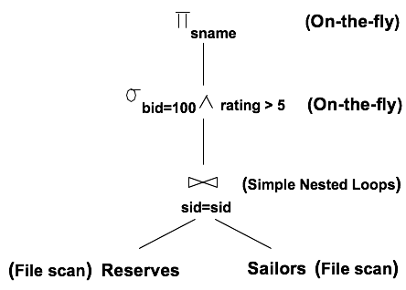

$Simple\ Nested\ Loops = 500 + 500\times 1000 = 500500\ I/Os$

#### On-the-fly Evaluation

* The evaluation of $Op_2$ is **on-the-fly** if the result of $Op_1$ is **directly sent** to $Op_2$

  **NOT** stored in a temporary file and without disk access

* Also called **pipelined evaluation**

#### Materialized Evaluation

* The result is stored in a temporary file first
* Required more disk accesses

## Concurrency Control

* Transaction is atomic and a sequence of read/write operations

```c
t1:	read(a)						t2:	a = 100
	a = a + 100						write(a)
	write(a)						read(a)
```

​	$T_1 = r_1[a]w_1[a]$					$T_2 = w_2[a]r_2[a]$

#### Serial Schedule

* The operations belonged to same single transaction appear together

  $T_1: r_1[a]w_1[a]$

  $T_2:\ \ \ \ \ \ \ \ \ \ \ \ \ \ \ \ \ w_2[a]r_2[a]$

#### Serializable Schedule

* The effect is equivalent to some serial schedules

  $T_1: r_1[a]\ \ \ \ \ \ \ \ \ \ w_1[a]$

  $T_2: \ \ \ \ \ \ \ \ \ w_2[b]\ \ \ \ \ \ \ \ \ \ r_2[a]$

  ​	Equivalent to $T_1T_2$

  $T_1: r_1[a]w_1[a]$

  $T_2: \ \ \ \ \ \ \ \ \ \ \ \ \ \ \ \ \ \ \ w_2[b]r_2[a]$

#### View Serializability

* Two schdules $H$ and $H'$are view equivalent if
  1. Same set of transactions and same operations
  2. For any x, if $T_i$ reads x from $T_j$ in $H$, then also in $H'$
  3. For each x if $w_i[x]$ is final write of x in $H$ then also in $H'$
* A schedule is view serializable if it is **view equivalent to a serial schedule**

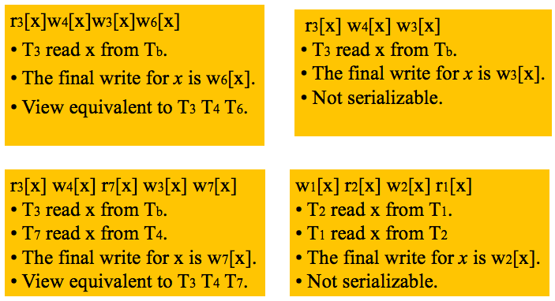

#### Conflict Serializability

* Non-conflicting operations can always be **swapped without affecting result** of other operations
* Swapable operations: $r_i[x]r_j[x] \iff r_j[x]r_i[x]$
* Two histories $H$ and $H'$ are **conflict equivalent** if
  1. Same set of transactions and same operations
  2. For any conflicting operations $p_i$ and $q_j$, if $p_i$ appears before $q_j$ in $H$ then same as $H'$
* A history is **conflict serialisable** if it is **conflict equivalent** to a serial history

Testing for conflict serializability = **Serialization Graph**

​	$V = \{T_1,…,\ T_n\}\ is\ set\ of\ transactions$

​	$E\ contains\ (t_i,t_j)\ if\ one\ of\ T_i\ operations\ precedes\ and\ conflicts\ with\ other$

* It is conflict serializable iff there exists a DAG in serialization graph

#### Lock-based Protocols

* Two kinds of locks
  * Shared-locks for read operations
  * Exclusive-locks for write operations
* Shared-lock allowed read but not write operations
* Exclusive lock does not allow both read and write operations

#### Two-phase Locking Protocol

* Each transaction issues lock and unlock requests in two phases

  * Growing phase: A transaction **may obtain locks** but may **not release any lock**

    Lock can be **upgrade** in the growing phase

  * Shrinking phase: A transaction **may release locks** but may **not obtain any new lock**

    Lock can be **downgrade** in the shrinking phase

## Recovery

#### Log-based Recovery

* Each record describes single database write and has following fields

  $<Transaction\ name,\ item\ name,\ old\ value,\ new\ value>$

* Some Special log records: $<T_i,start>,<T_i,commits>,<T_i,abort>$

#### Immediate Database Modification (undo/redo)

* Transaction $T_i$ needs to **undo** if the log contains $<T_i,start>$ but not contain $<T_i,commits>$
* Transaction $T_i$ needs to **redo** if the log contains both $<T_i,start>$ and $<T_i,commits>$

#### Deferred Database Modification (No-undo/redo)

* Each record describes single database write and has following fields

  $<Transaction\ name,\ item\ name,\ new\ value>$

* Transaction $T_i$ needs to **redo** if the log contains both $<T_i,start>$ and $<T_i,commits>$